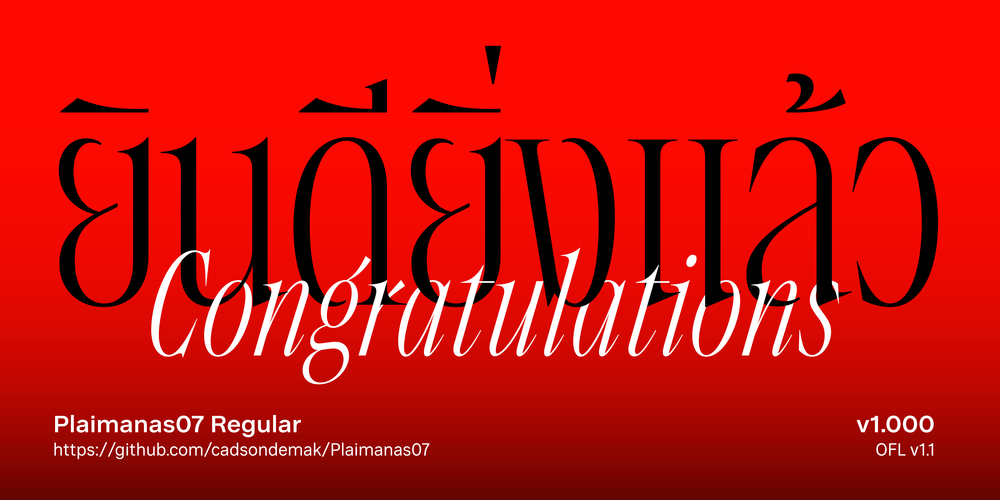

# My Font

[![][Fontbakery]](https://cadsondemak.github.io/Plaimanas07.git/fontbakery/fontbakery-report.html)
[![][Universal]](https://cadsondemak.github.io/Plaimanas07.git/fontbakery/fontbakery-report.html)
[![][GF Profile]](https://cadsondemak.github.io/Plaimanas07.git/fontbakery/fontbakery-report.html)
[![][Shaping]](https://cadsondemak.github.io/Plaimanas07.git/fontbakery/fontbakery-report.html)

[Fontbakery]: https://img.shields.io/endpoint?url=https%3A%2F%2Fraw.githubusercontent.com%2Fcadsondemak%2FPlaimanas07.git%2Fgh-pages%2Fbadges%2Foverall.json
[GF Profile]: https://img.shields.io/endpoint?url=https%3A%2F%2Fraw.githubusercontent.com%2Fcadsondemak%2FPlaimanas07.git%2Fgh-pages%2Fbadges%2FGoogleFonts.json
[Outline Correctness]: https://img.shields.io/endpoint?url=https%3A%2F%2Fraw.githubusercontent.com%2Fcadsondemak%2FPlaimanas07.git%2Fgh-pages%2Fbadges%2FOutlineCorrectnessChecks.json
[Shaping]: https://img.shields.io/endpoint?url=https%3A%2F%2Fraw.githubusercontent.com%2Fcadsondemak%2FPlaimanas07.git%2Fgh-pages%2Fbadges%2FShapingChecks.json
[Universal]: https://img.shields.io/endpoint?url=https%3A%2F%2Fraw.githubusercontent.com%2Fcadsondemak%2FPlaimanas07.git%2Fgh-pages%2Fbadges%2FUniversal.json

Description of your font goes here. We recommend to start with a very short presentation line (the kind you would use on twitter to present your project for example), and then add as much details as necesary :-) Origin of the project, idea of usage, concept of creation… but also number of masters, axes, character sets, etc.

Don't hesitate to create images!

## About

Plaimanas07

Plaimanas07 is an open-source Thai typeface designed by Parin Rungpattaratkhun, in collaboration with Cadson Demak.  

This project began as a personal exploration into Thai letterform aesthetics, particularly focusing on how traditional calligraphy could inform a modern digital font.

While many Thai typefaces prioritize legibility or system utility, Plaimanas07 seeks to fill a different gap — the lack of Thai fonts with artistic elegance.  

The design is rooted in Thai calligraphy but redrawn with a contemporary eye, balancing emotion with precision.

This typeface is offered as a gift to the design community, with the hope that more designers will be inspired to create and elevate Thai script.

**Note:** All drawings are original. This is not a modification of an existing Thai typeface.

## Building

Fonts are built automatically by GitHub Actions - take a look in the "Actions" tab for the latest build.

If you want to build fonts manually on your own computer:

* `make build` will produce font files.
* `make test` will run [FontBakery](https://github.com/googlefonts/fontbakery)'s quality assurance tests.
* `make proof` will generate HTML proof files.

The proof files and QA tests are also available automatically via GitHub Actions - look at https://cadsondemak.github.io/Plaimanas07.git.

## Changelog

When you update your font (new version or new release), please report all notable changes here, with a date.
[Font Versioning](https://github.com/googlefonts/gf-docs/tree/main/Spec#font-versioning) is based on semver. 
Changelog example:

**19 Jun 2025. Version 1.0**
-Release on Github.

## License

This Font Software is licensed under the SIL Open Font License, Version 1.1.
This license is available with a FAQ at https://openfontlicense.org

## Repository Layout

This font repository structure is inspired by [Unified Font Repository v0.3](https://github.com/unified-font-repository/Unified-Font-Repository), modified for the Google Fonts workflow.
